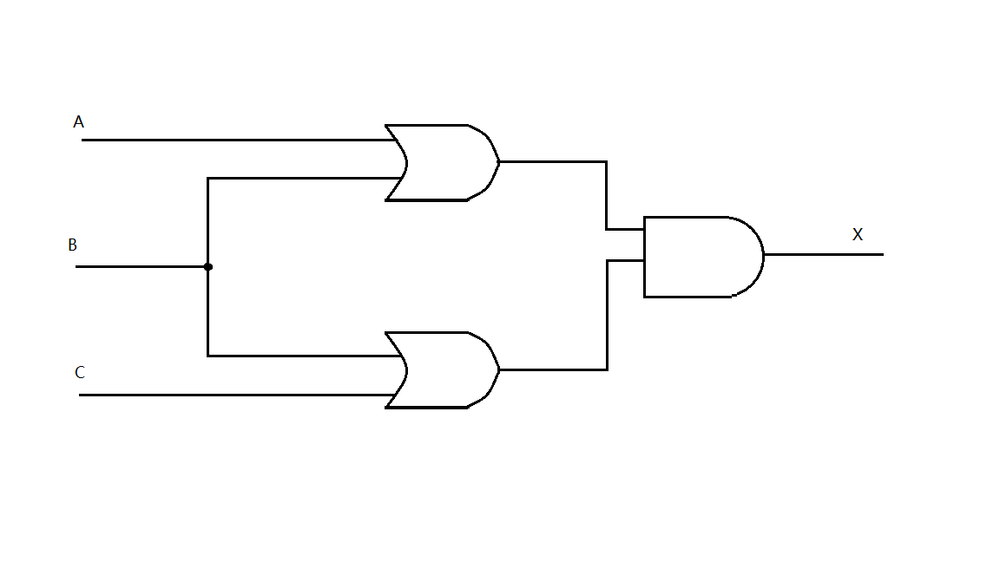
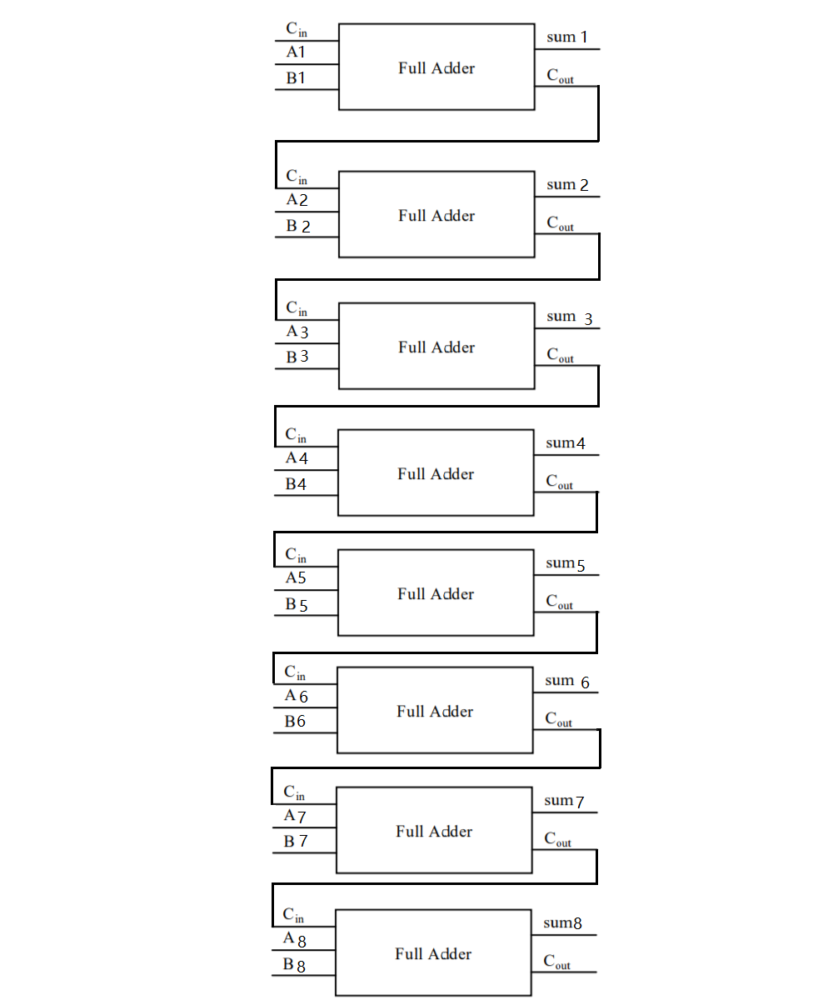

# Part 1
## 1)AND
1 and 1=1;
0 and 1=0;
0 and 0=0;

与门表示只要有一输入为0，则输出为0。
## 2)XOR
0 xor 0=0;
1 xor 1=0;
1 xor 0=1;

异或门表示两输入相同时为0，不同时为1。
## 3)Circuit diagram 
X=(A+B)(B+C):

## 4)Truth table
表示(A')xor(AB)

|A|B|A'|AB|(A')xor(AB)|
|:--:|:--:|:--:|:--:|:--:|
|0|0|1|0|1|
|0|1|1|0|1|
|1|0|0|0|0|
|1|1|0|1|1|
## 5)Prove
(AB)'

|A|B|AB|(AB)'|
|:--:|:--:|:--:|:--:|
|0|0|0|1|
|0|1|0|1|
|1|0|0|1|
|1|1|1|0|

A'+B'

|A|B|A'|B'|A'+B'|
|:--:|:--:|:--:|:--:|:--:|
|0|0|1|1|1|
|0|1|1|0|1|
|1|0|0|1|1|
|1|1|0|0|0|

两式真值表结果相同，(AB)'=A'+B'
## 6)

## 7)
### (1)
(X8X7X6X5X4X3X2X1)2 or (00001111)2 = (X8X7X6X51111)2
### (2)
(X8X7X6X5X4X3X2X1)2 xor (00001111)2 = (X8X7X6X5X'4X'3X'2X'1)2
### (3)
((X8X7X6X5X4X3X2X1)2 and (11110000)2) or (not (X8X7X6X5X4X3X2X1)2 and (00001111)2) = (X8X7X6X5X'4X'3X'2X'1)2
# Part 2
## 1)Logic gate
In electronics, a logic gate is an idealized or physical device implementing a Boolean function; that is, it performs a logical operation on one or more binary inputs and produces a single binary output.
## 2)Boolean algebra
In mathematics and mathematical logic, Boolean algebra is the branch of algebra in which the values of the variables are the truth values true and false, usually denoted 1 and 0 respectively. 
## 3)Flip-flop
### 1)
触发器
### 2)
1bit 