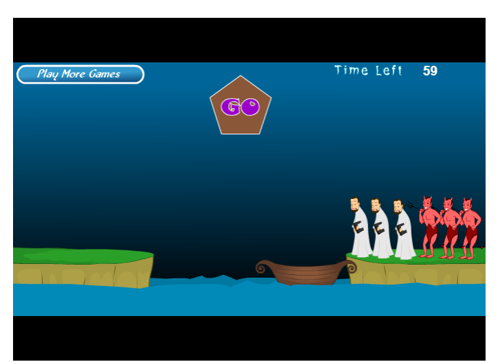

# 一、阅读“牧师与恶魔过河”的游戏介绍并玩游戏。然后回答问题
## 1.游戏涉及哪些类。请列表说明 
|类|说明|
|:--:|:--:|
|背景|游戏场景|
|牧师|游戏对象|
|魔鬼|游戏对象|
|船|让牧师与魔鬼过河|
|按钮|控制船的行动|
|文本|显示游戏倒计时与信息|


## 2.游戏中有哪些对象，各几个。例如，船（一个） 
|对象|数量|
|:--:|:--:|
|背景|1|
|牧师|3|
|魔鬼|3|
|船|1|
|按钮|1|
|文本|2|
## 3.类和对象的区别是什么？举一个例子说明 
对象是与问题背景相关的事物与实体。

类是属性和行为相似的一组对象的说明。

游戏中魔鬼是一个对象类，共有三个魔鬼，每个都是一个对象。
## 4.游戏中的魔鬼，有哪些属性和方法？ 
属性：名字，图片，动画，位置

方法：
当在岸上被点击，播放动画，移动到船上

当在船上被点击，播放动画，移动到岸上

当某一边的岸上（包括接近该岸的船）的牧师数量少于魔鬼，播放动画，杀死牧师
## 5.假设魔鬼被鼠标点中，会执行onclick事件，请用文字（伪代码）描述这个事件中魔鬼与其他对象沟通的过程。 
```
IF onclick THEN
    IF 魔鬼与船在同一岸 THEN
        IF 魔鬼在岸上 THEN
            IF 船没有满员 THEN
                移动到船上
            ELSE
                不移动
        ELSE
            移动到岸上
        ENDIF
    ENDIF
ELSE
    不移动
ENDIF
```
## 6.类或对象会是动词吗？
类和对象的名字一般不以动词命名。