# 制作游戏
    利用Construct2可以制作各类2D游戏，下面我们来介绍如何运用Construct2来制作游戏。
## `开始`
首先，打开Construct2，新建一个文件，点击图中按钮或输入Ctrl+N。

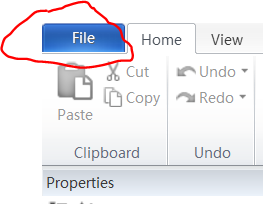

选择第一个

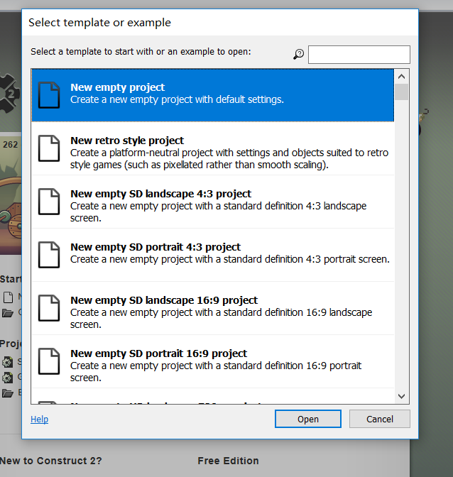
## `插入背景`
让我们来插入一个背景，双击空白区域,选择TiledBackground，插入

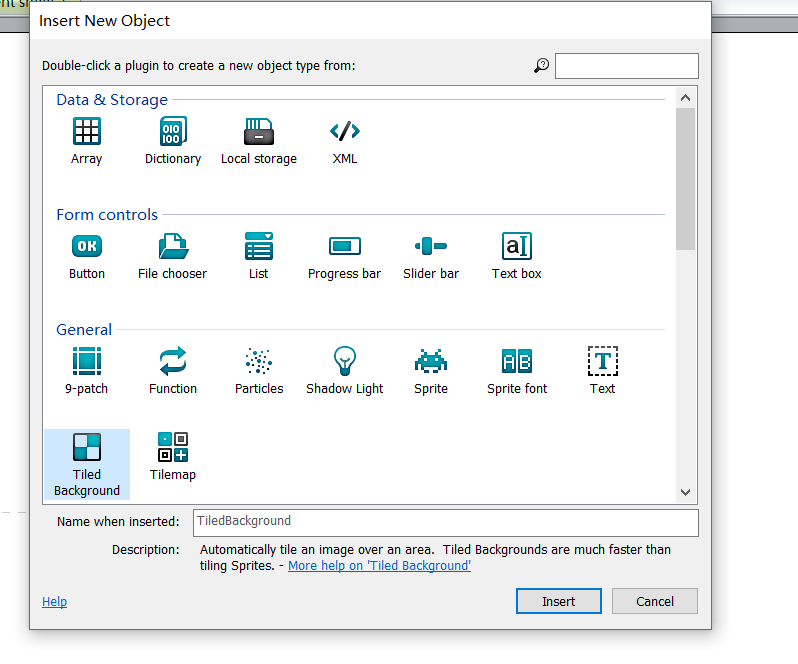

此时鼠标会变为十字光标，左键点击空白区域

点击图中红圈位置，打开文件

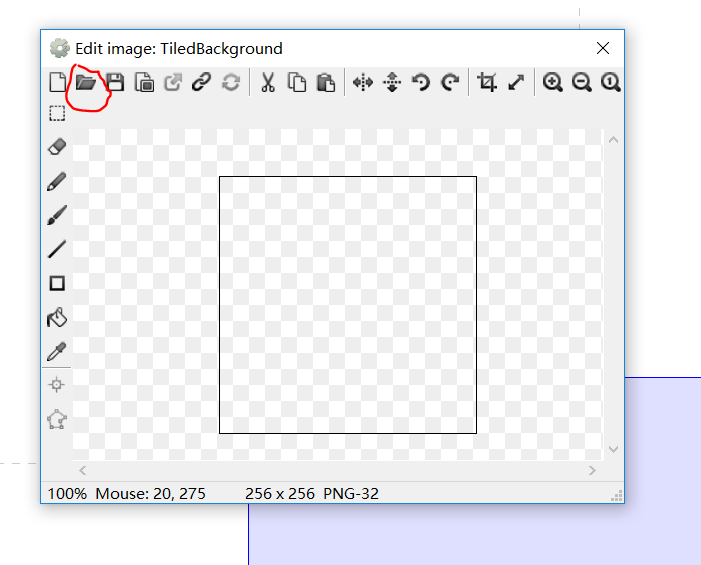

插入后可以在左侧看到背景的属性

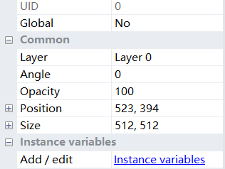

将Position改为0,0，Size改为原布局的规格

原布局的规格

更改后

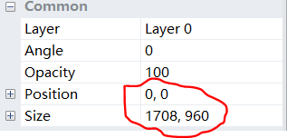

点击图中按钮运行一下,你就可以看到你的背景了

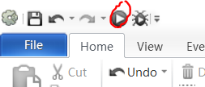
## `添加层`
层的内容位于右下角，点击layers

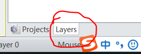

点击图中按钮添加层

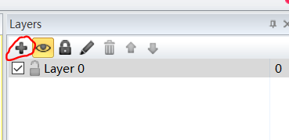

为了区分，点击铅笔按钮重命名
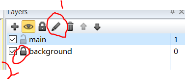

点击锁标记可以锁定该层，如图，background层已锁定
## `添加鼠标和键盘`
双击布局，选择鼠标和键盘以添加，用于响应之后的事件
## `添加精灵`
接下来，让我们添加游戏中的角色，这些被称作**精灵**

确定目前已选中主层，双击布局，添加精灵

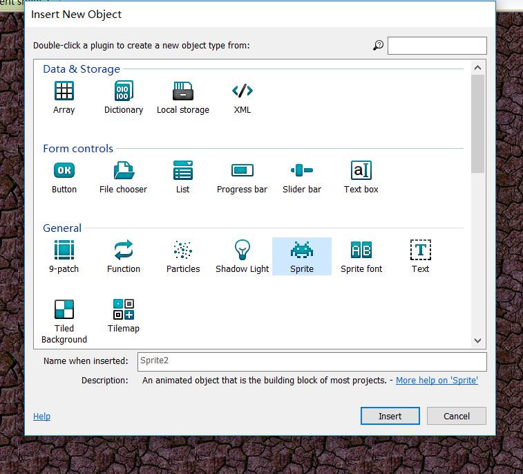

按照添加背景的方法添加精灵，我们需要添加三种精灵，分别是玩家操作，作为敌人和作为得分用的

你可能还需要爆炸作为特效，添加精灵用于特效（先将其移除布局，因为开始时不需要特效）

接下来让我们来为它重命名以作区分

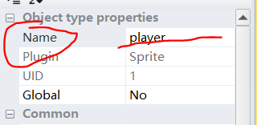

## `添加行为`
    接下来我们需要让它们动起来，添加行为以满足游戏中的需要。
### 为玩家添加行为
首先，让我们为玩家添加行为，我们需要的行为有8 Direction（向各方向移动），Scroll To（让屏幕跟随玩家移动）和Bound to layout（让玩家不要走出边界）

选中玩家，在左侧找到行为一项，点击编辑

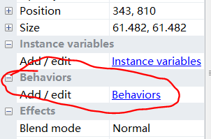

添加新的行为

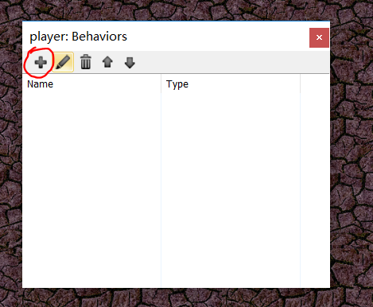

选择8 Direction一项

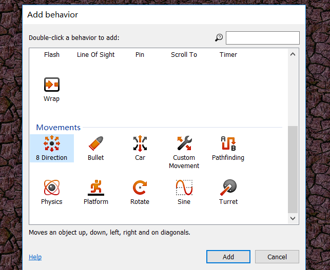

重复以上步骤以添加其他行为

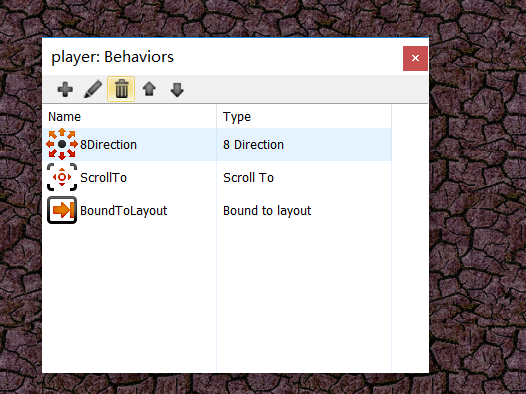

让我们运行一下游戏，可以看到玩家的移动了
### 添加其他行为
让我们为其他精灵添加行为，需要的行为有

1、为敌人添加Bullet movement（敌人需要移动）

2、为爆炸添加Fade

你还可以根据需要添加其他行为，让我们先添加这些

接下来，更改敌人的移动速度，添加移动行为后可以找到速度一项，将其改为80（可根据具体需要调整）

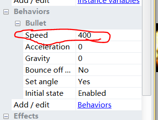

将爆炸消失时间改为0.5秒

运行一下以测试我们的更改
## `添加更多得分标志`
按住Ctrl，用鼠标点击得分标志并拖动，先添加至10个（这些是开局时的得分标志）
## `添加事件`
    我们需要事件来完善这个游戏

### 第一个事件
点击上侧的事件表以进入

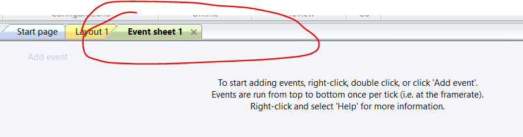

右键，点击添加事件，先添加第一个事件，让玩家跟随鼠标转动

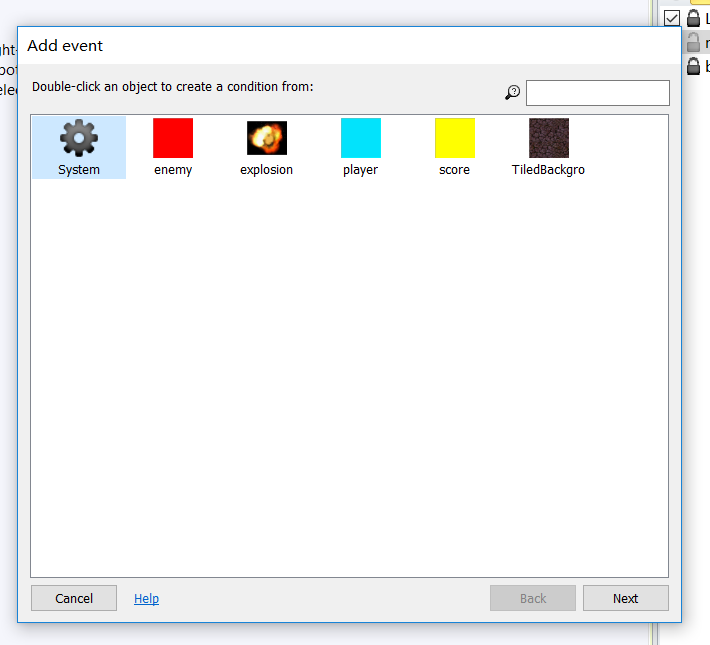

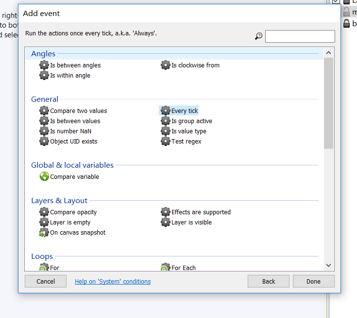

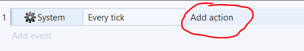

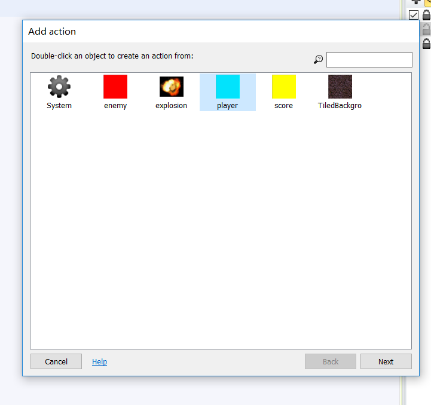

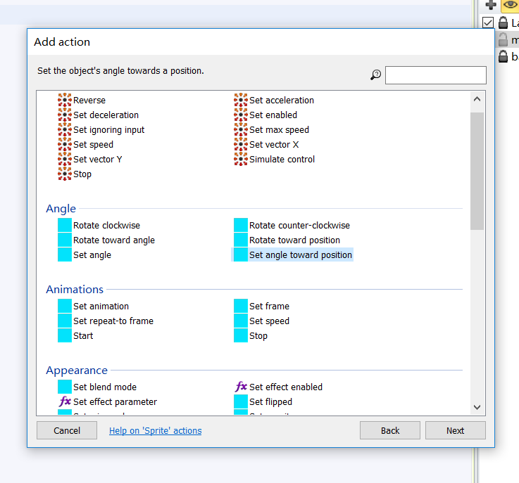

Construct2中提供表达式以输入，输入表达式，如下

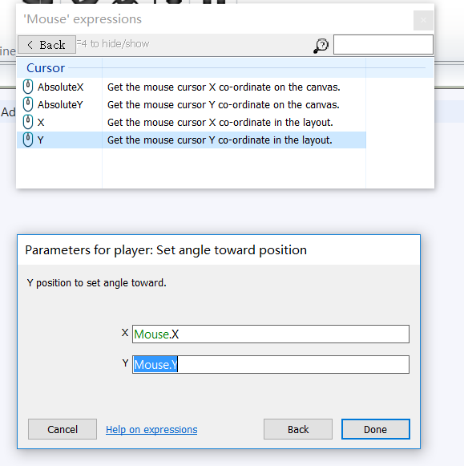

最终的效果

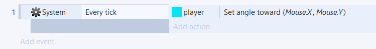

### 添加其他事件
添加其他事件以完善游戏，需要的事件有

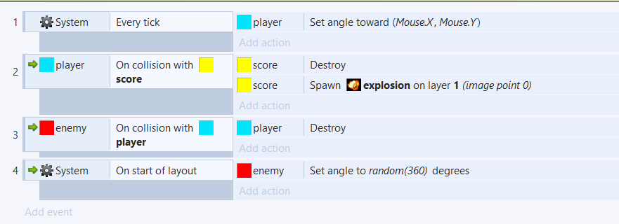
## `添加更多高级内容`
### `添加分数`
让我们添加分数来标记得分

锁定主层，添加新层，命名为HUD

选择HUD层，双击布局，添加文本

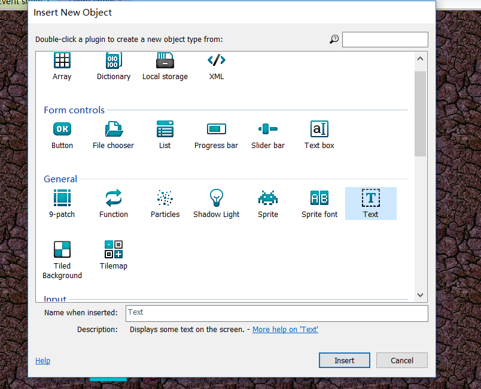

在事件表下单击右键，选择添加变量（global variable），命名为SCORE

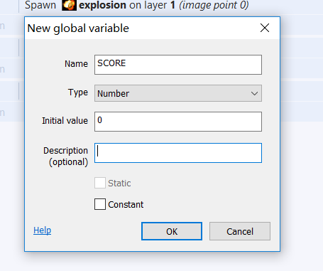

在System Every tick事件下添加行为

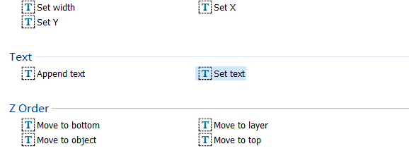

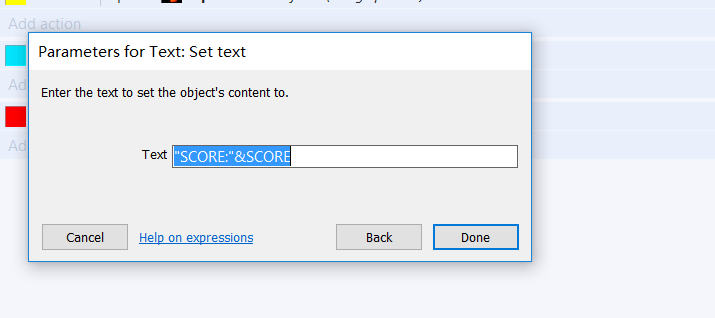

接下来，添加在碰撞得分标记时玩家得分

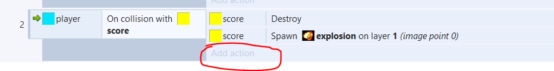

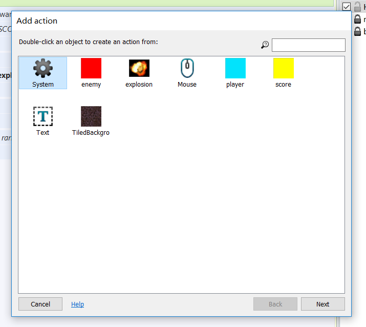

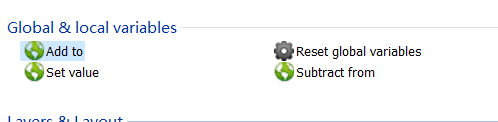

最终效果

### `让计分板跟随玩家`
为玩家添加图像点，双击玩家，在稍远的得分添加图像点

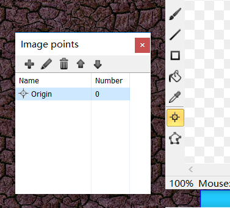

添加事件如下（改变字体颜色让其明显）

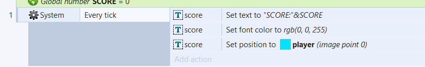

### `特效`
让爆炸的特效更好，更改爆炸效果，改为additive

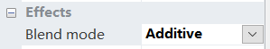
### `其他事件`
添加事件(让敌人跟随玩家)

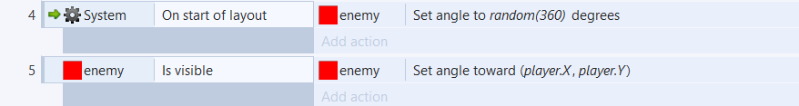

添加事件（生成新得分标志）

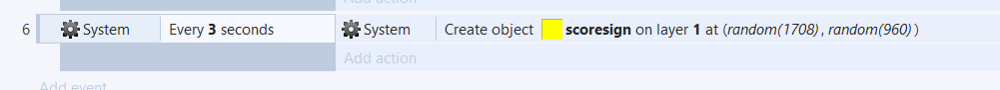

## `效果演示`
    这就是大概的游戏制作方式，如果还需要更多事件可以按照以上方法自行添加，让我们来演示一下大致的最终效果

