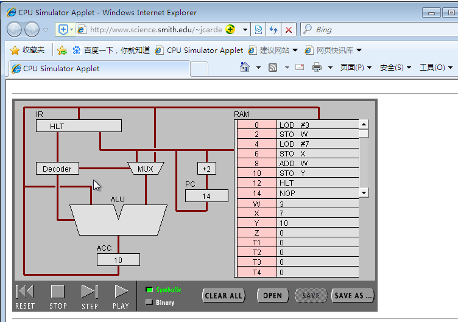
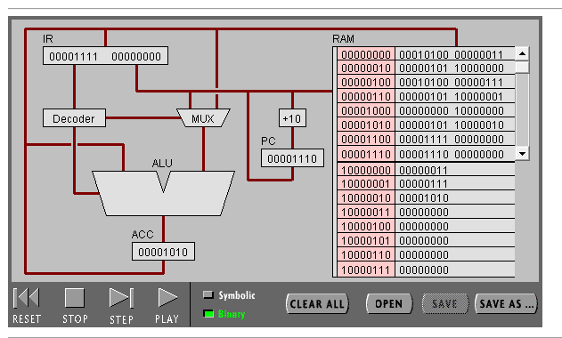
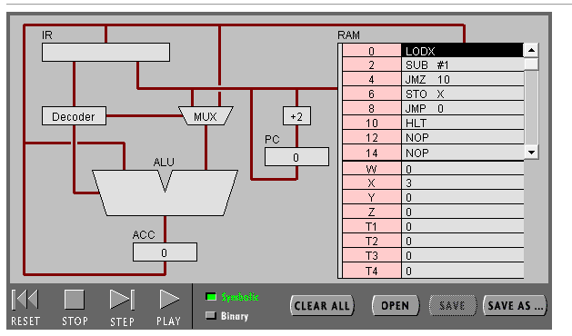
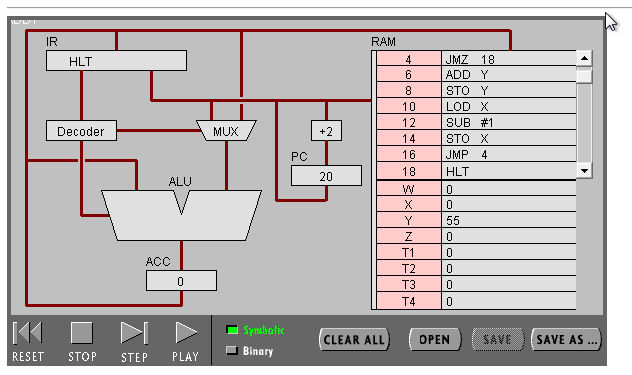

1.[机器语言实验报告](lab07.pdf)

# 一、实验目标
## 任务 1：简单程序
### （1）打开网页 The PIPPIN User’s Guide ，然后输入 Program 1：Add 2 number
### （2）点step after step。观察并回答下面问题：
1、PC，IR 寄存器的作用。

2、ACC 寄存器的全称与作用。

3、用“LOD #3”指令的执行过程，解释Fetch-Execute周期。

4、用“ADD W” 指令的执行过程，解释Fetch-Execute周期。

5、“LOD #3” 与 “ADD W” 指令的执行在Fetch-Execute周期级别，有什么不同。
### （3）点击“Binary”,观察回答下面问题
1、写出指令 “LOD #7” 的二进制形式，按指令结构，解释每部分的含义。

2、解释 RAM 的地址。

3、该机器CPU是几位的？（按累加器的位数）

4、写出该程序对应的 C语言表达。
## 任务 2：简单循环
###（1） 输入程序Program 2，运行并回答问题：
1、用一句话总结程序的功能

2、写出对应的 c 语言程序
### （2） 修改该程序，用机器语言实现 10+9+8+..1 ，输出结果存放于内存 Y
1、写出 c 语言的计算过程

2、写出机器语言的计算过程

3、用自己的语言，简单总结高级语言与机器语言的区别与联系。
 
# 二、实验步骤与结果
## 任务1：简单程序
### （1）Program 1：Add 2 number
 
### （2）
#### 1、PC、IR的作用
PC：寄存下一条要读取的指令的地址

IR：寄存正在执行的指令
#### 2、ACC寄存器的全称与作用
ACC全称累加器，用来储存计算产生的中间结果。
#### 3、用“LOD #3”指令的执行过程，解释Fetch-Execute周期。
1．读取指令“LOD #3”，放在IR中

2．译码指令

3．如果需要，获取数据：无

4．执行指令：将3寄存在ACC中

5．PC加2  
#### 4、用“ADD W” 指令的执行过程，解释Fetch-Execute周期。
1．读取指令“ADD W”，放入IR

2．译码指令

3．获取数据：W

4．执行指令：将ALU中两数相加，结果放在ACC中

5．PC加2
#### 5、“LOD #3” 与 “ADD W” 指令的执行在Fetch-Execute周期级别，有什么不同。
第3步获取数据，“LOD #3”执行时不需要数据，不获取；“ADD W”执行时需要数据，获取数据。
### （3）
 
#### 1、写出指令 “LOD #7” 的二进制形式，按指令结构，解释每部分的含义。
00010100  00000111

前一个数为指令，后一个为操作数。指令第4位为寻址模式，1表示操作数为数据，后4位为具体指令。操作数表示7。
#### 2、解释 RAM 的地址。
地址是对内存空间进行编码的方法，当数据保存到内存后，可根据其地址编码快速找到存储的数据。
#### 3、该机器CPU是几位的？（按累加器的位数）
8位
#### 4、写出该程序对应的 C语言表达。
```c
int main() {
    int w=3;
    int x=7;
    int y=w+x; 
    
    return 0;
}
```
## 任务2：简单循环
### （1）Program 2
 
#### 1、用一句话总结程序的功能
将X减1至X=0。
#### 2、写出对应的 c 语言程序
```c
int main() {
    int x=3;

    while(x!=0) {
        x--;
    }

    return 0;
}
```
### （2）修改该程序，用机器语言实现 10+9+8+..1 ，输出结果存放于内存 Y
 
#### 1、写出 c 语言的计算过程
```c
int main() {

    int x=10,y=0;

    while(x>0) {
        y=y+x;
        x--;
    }
	
    return 0;
}
```
#### 2、写出机器语言的计算过程
0 LOD #10

2 STO X

4 JMZ 18

6 ADD Y

8 STO Y

10 LOD X

12 SUB #1

14 STO X

16 JMP 4

18 HLT
#### 3、用自己的语言，简单总结高级语言与机器语言的区别与联系。
机器语言：操作硬件，计算机能直接读取，人难以理解。

高级语言：接近人类语言，易于理解，需要编译成机器语言来执行。