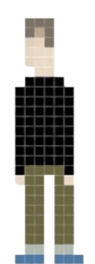

# 游戏设计与制作（进阶）
## 一、游戏策划
Setting：一个简单的追逐游戏，你需要做的是躲过怪物活下来并得分，当然是得分越高越好。随着游戏进行怪物越来越多而可得分数越来越少，难度也会随之增大，看你能够得到多少分！

人物与道具：很简单，这个游戏里只有玩家，怪物和得分标志。

1. 玩家：可进行上下左右移动，躲避怪物，碰到得分标志就能得分！
2. 怪物：追逐玩家，**会加速**！随游戏进行会生成新怪物，碰到玩家，游戏结束。
3. 得分标志：碰到后得分加一，每到十分，清除一次场上怪物（全部！），并有**加分**！

## 二、游戏开发小结（CRC卡片）
1. 玩家

|||
|:--:|:--:|
|Object Name|player|
|Attributes|图层1，生成于场景中央|

Collaborator:

|Events|Actions|
|:--:|:--:|
|与scoresign碰撞|SCORE加1，生成爆炸特效|
|被摧毁|显示Game Over|
|向左（右）移动|转向左（右）|

2. 怪物

|||
|:--:|:--:|
|Object Name|enemy|
|Attributes|图层1，随机生成，初始速度80|

Collaborator:

|Events|Actions|
|:--:|:--:|
|与player碰撞|player摧毁|
|在可视范围内|转向player方向|
|当分数大于等于10，每随机2到7秒|随机生成一只enemy|
|每秒|速度加1|

3. 得分标志

|||
|:--:|:--:|
|Object Name|scoresign|
|Attributes|图层1，随机生成|

Collaborator:

|Events|Actions|
|:--:|:--:|
|分数是大于0的10的倍数|摧毁所有enemy，SCORE加1|

4. 爆炸

|||
|:--:|:--:|
|Object Name|exposion|
|Attributes|scoresign被摧毁时生成，一段时间消失|

Collaborator:

|Events|Actions|
|:--:|:--:|
|过0.5秒|逐渐消失|

## 三、游戏效果演示

1. 怪物摧毁

2. 多重怪物

3. 分数显示

