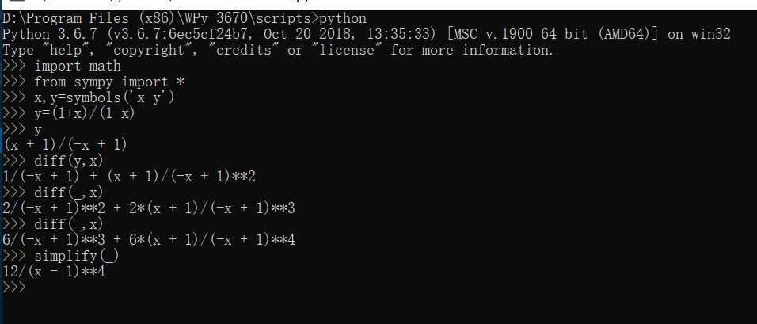

# 一、实验目的
1.了解一种“解释型”语言 python

2.使用 python 做一些简单的科学计算
# 二、实验步骤与结果
## 1.高等数学
### 1.1
$y=\frac{1+x}{1-x}(x\neq1),求\frac{d^{3}y}{dx^{3}}.$

算法：将y求导3次即得到三次导数.

演示：

答案：$\frac{d^{3}y}{dx^{3}}=\frac{12}{(x-1)^{4}}.$
### 1.2
