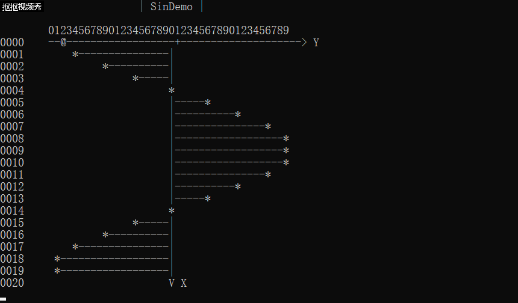
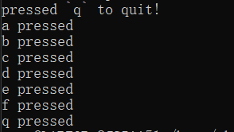
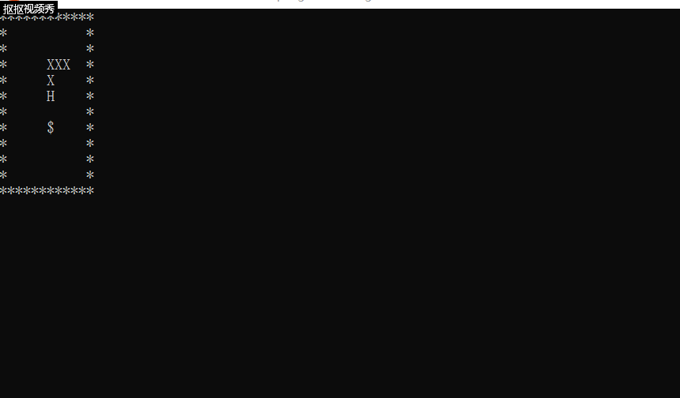
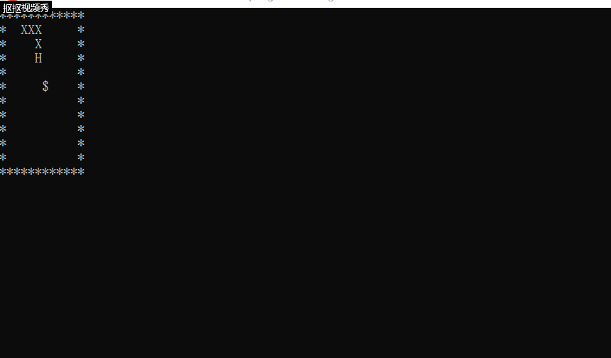
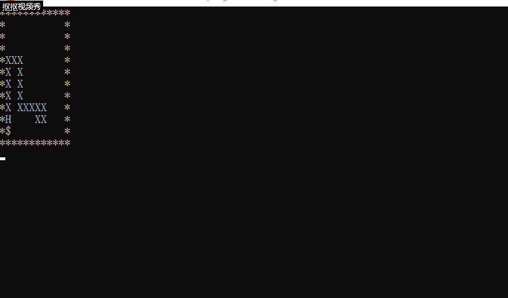

# 智能蛇实验报告
## 一、实验目的
1、了解 算法 与 “智能” 的关系

2、通过算法赋予蛇智能

3、了解 Linux IO 设计的控制
## 二、控制输入/输出设备
### 1、sin函数
在字符终端上完成“清屏”“修改光标位置”“设置字符前景和背景色”等操作，是通过输出 esc序列实现的。对于 VT100 终端, printf("\033[2J") 就实现了清屏。

sin.out程序运行结果：



### 2、实现 kbhit()
tty.out运行结果



## 三、在linux中实现贪吃蛇字符游戏
### 1、人控蛇游戏演示



### 2、智能蛇
#### 决定蛇行走的方向函数的伪代码

```
    // Hx,Hy: 头的位置
    // Fx,Fy：食物的位置
function whereGoNext(Hx,Hy,Fx,Fy) {
	用数组movable[3]={“a”,”d”,”w”,”s”} 记录可走的方向
	用数组distance[3]={0,0,0,0} 记录离食物的距离
	分别计算蛇头周边四个位置到食物的距离。H头的位置，F食物位置
    例如：假设输入”a” 则distance[0] = |Fx – (Hx-1)| + |Fy – Hy|
    如果 Hx-1，Hy 位置不是Blank，则 distance[0] = 9999
    选择distance中存最小距离的下标p，注意最小距离不能是9999
    返回 movable[p]
}
```

#### 游戏代码(方向函数与main函数)

```c
int main() {
    int flag=1;
    int diretion='d';

    putFood();
    output();
    while(flag) {
        usleep(500000);
        system("clear");

        diretion=whereToGoNext(snakeX[0],snakeY[0],food[0],food[1],diretion);

        switch(diretion) {
            case 'a':snakeMove(-1,0,&flag);break;
            case 'w':snakeMove(0,-1,&flag);break;
            case 's':snakeMove(0,1,&flag);break;
            case 'd':snakeMove(1,0,&flag);break;
        }

        output();
    }
    gameover();
    
    return 0;
}
```

```c
int whereToGoNext(int hx,int hy,int fx,int fy,int diretion) {
	int i=0,min,p=0;
	int movable[4] = {'a','w','s','d'};
	int distance[4] = {0,0,0,0};
	
	for(i=0;i<4;i++) {
		switch(i) {
			case 0:
				if(map[hy][hx-1] != BLANK_CELL && map[hy][hx-1] != SNAKE_FOOD) {
					distance[i]=9999;
				}
				else {
					distance[i]=abs(fx-(hx-1))+abs(fy-hy);
				}
				break;
			case 1:
				if(map[hy-1][hx] != BLANK_CELL && map[hy-1][hx] != SNAKE_FOOD) {
					distance[i]=9999;
				}
				else {
					distance[i]=abs(fx-hx)+abs(fy-(hy-1));
				}
				break;
			case 2:
				if(map[hy+1][hx] != BLANK_CELL && map[hy+1][hx] != SNAKE_FOOD) {
					distance[i]=9999;
				}
				else {
					distance[i]=abs(fx-hx)+abs(fy-(hy+1));
				}
				break;
			case 3:
				if(map[hy][hx+1] != BLANK_CELL && map[hy][hx+1] != SNAKE_FOOD) {
					distance[i]=9999;
				}
				else {
					distance[i]=abs(fx-(hx+1))+abs(fy-hy);
				}
				break;
		}
	}
	
	min=distance[0];
	for(i=1;i<4;i++) {
		if(min>distance[i]) {
			min=distance[i];
			if(min != 9999) {
				p=i;
			}
		}
	}
	
	if(min != 9999) {
		return movable[p];
	}
	else {
		return diretion;
	}
}
```

#### 演示




